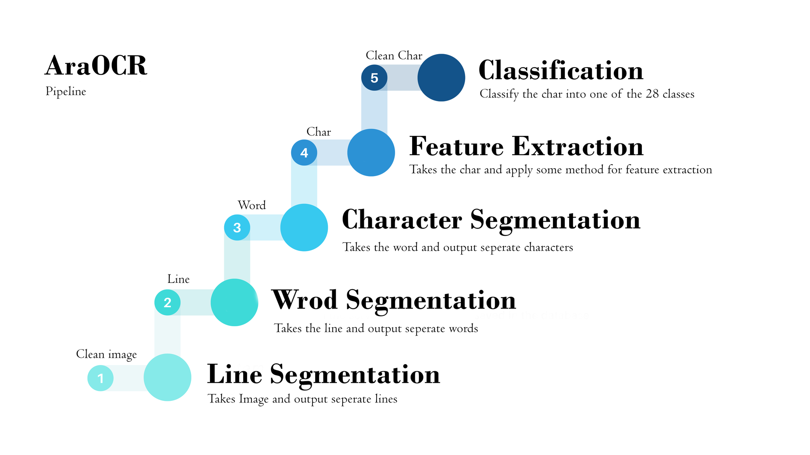
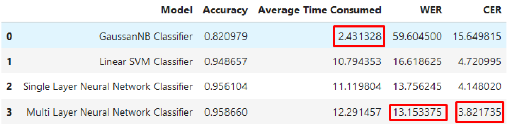

# AraOCR

Optical character recognition (OCR). Our goal is creating an application that could take a picture of the handwritten words “السلام عليكم ” and give the computer the actual text “السلام عليكم ” instead of just a picture that the computer can’t understand.
OCR uses a series of machine learning models to turn a picture with text in it into text characters that a computer can read and manipulate. It does this with a five-step process, where each step uses different methods to make different output:
* Line Segmentation: takes the image and divide it into sperate lines.
* Word Segmentation: takes the line and divide it into sperate words.
* Character Segmentation: takes the word and divide it into separate characters.
* Feature Extraction: applying some methods to extract features from the character.
* Character Classification: classify the character into one of the 28 classes (Arabic characters).




## Dataset
you can download the dataset from [here](https://drive.google.com/drive/folders/1Nbp9ZXLlWV3n8yRMwj2gjs_rE6qGZU01)

## Quick Start
This repository is build upon Python v3.9 and Ubuntu 20.04. NVIDIA GPUs are advised to train. See [requirements.txt](https://github.com/ElFarash/AraOCR/blob/main/requirements.txt) for other dependencies. you can install dependencies with the following commands.

```
pip3 install -r requirements.txt
```

Make sure to download the pretrained model provided in the AraOCR/models/ before testing the system. and set the folder filled with images you want to test and set directories in the run.py file then run the command. (in case you have no images to test the system will test the default first 20 images on the dataset).

```
python3 run.py
```

After Conducting serval experiments, we improved the CER from 15.64 (Gaussian Naïve Bayes (baseline)) to 3.82 (multi-layer neural network classifier) which is good CER and good accuracy but took much more time on the interface ran on the cpu. Many more experiments could be conducted in the feature extraction stage and in the classifier stage to improve the CER and WER for optimal value (for example, CER=0-2 & WER=0-10). 



for evaualting and regenrating the results use:
```
python3 evaluate.py "path to ref_string_folder" "path to ocr_output folder"
```

## Limitation & future work
* The System only works for classifiying letters (no numbers), so classes for number could be added to the classifiers.
* More expeirments could be conducted to further improve CER & WER.

